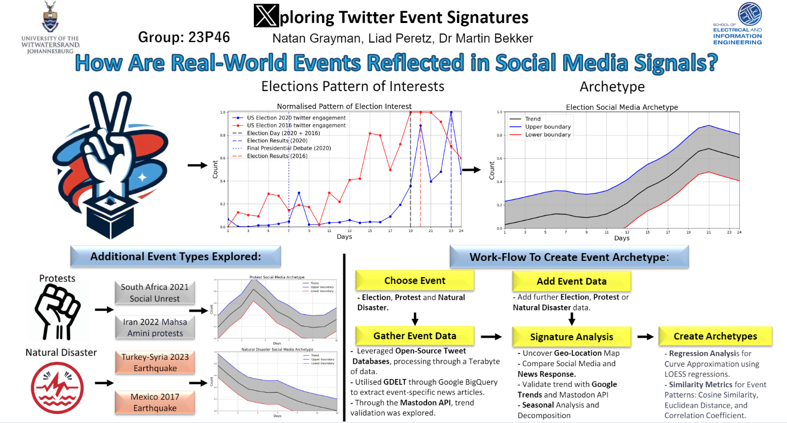

# Twitter Event Signatures

## Overview
This project investigates how real-world events are reflected in social media signals, particularly on Twitter.

The project achieved a distinction (80%) under the auspices of Prof. Martin Bekker ([LinkedIn](https://www.linkedin.com/in/martinbekker/)) and was moderated by ECSA.

